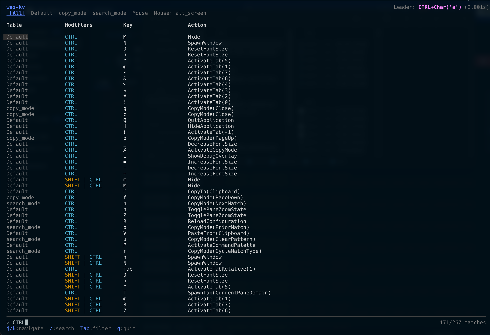

# wez-kv

Fuzzy-searchable TUI wrapper for [`wezterm show-keys`](https://wezterm.org/cli/show-keys.html). Parses the output and displays it in a color-coded, filterable table.



## Install

```bash
go install github.com/sorafujitani/wez-kv/cmd/wkv@latest
```

## Usage

```bash
wkv
```

Requires `wezterm` to be in your PATH.

## Keybindings

| Key | Action |
|-----|--------|
| `j` / `↓` | Move cursor down |
| `k` / `↑` | Move cursor up |
| `g` / `Home` | Go to top |
| `G` / `End` | Go to bottom |
| `Ctrl+d` | Half page down |
| `Ctrl+u` | Half page up |
| `/` | Start search |
| `Escape` | Exit search / clear filter |
| `Tab` | Next section filter |
| `Shift+Tab` | Previous section filter |
| `q` / `Ctrl+c` | Quit |

## License

MIT
